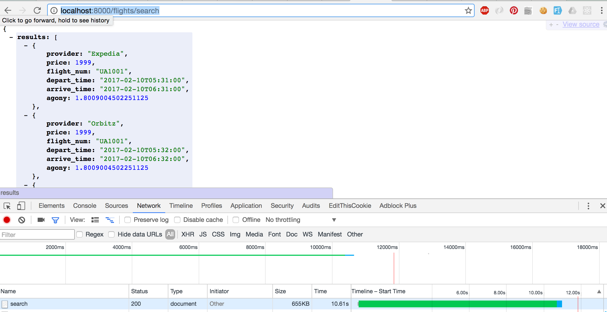
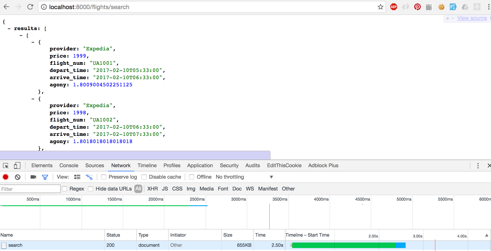
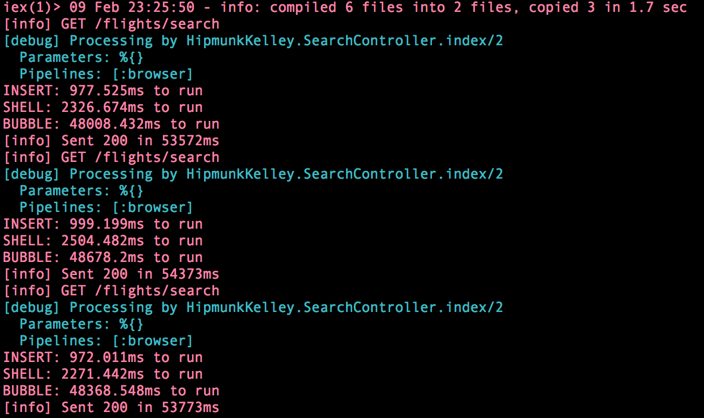

# Hipmunk Flight Server Challenge
**Author:** Kelley Scanlon
**Coded In:** Phoenix

## Getting Started
1. Start python server `python -m searchrunner.scraperapi`
2. Cd into Phoenix flight server `cd flight_phoenix_server`
3. Create Phoenix database (just so phoenix server works; not actually using db) `mix ecto.create`
4. Start Phoenix server `mix phoenix.server`
5. Retrieve all provider flights sorted by agony at url `http://localhost:8000/flights/search`

**NOTE:** Elixir was choosen because it can be easily optimized to quickly handle multiple requests. For example, this server could be optimized to asynchronously make API requests to each provider and concat once all responses have returned.

## UPDATE
1. Sped up API calls with Asynchronous calls using Task.async and Task.await
Compare these two screenshots of time on the search controller before & after.
BEFORE

AFTER

2. Benchmarked Sort algorithms & picked fastest
Used this website to compare different sort methods.https://www.toptal.com/developers/sorting-algorithms/nearly-sorted-initial-order  Decided to test the following 3 sort methods on how fast they sorted: Insert, Shell, Bubble. I picked Insert after reviewing 3 benchmark test pictured below.

